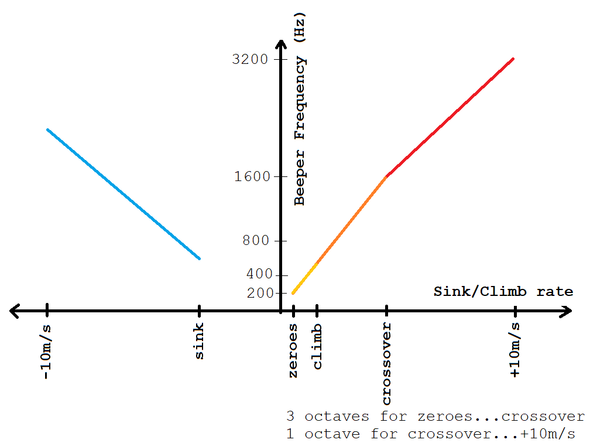

# ESP32C3_BLUETOOTH_AUDIO_VARIO
 Accurate, zero-lag audio variometer using Kalman filter fusion of accelerometer and pressure sensor data. 
 This project uses the [KF4D kalman filter algorithm from the ESP32_IMU_GPS_BARO_VARIO project](https://github.com/har-in-air/ESP32_IMU_BARO_GPS_VARIO/blob/master/offline/kf/compare_kf2_kf3_kf4.ipynb).

 Other features :
* WiFi Vario configuration via web page.
* WiFi Over-the-air (OTA) firmware updates. 
* Bluetooth LE transmission of [$LK8EX1 sentences](https://github.com/LK8000/LK8000/blob/master/Docs/LK8EX1.txt), to provide apps like [XCTrack](https://xctrack.org/) with 
accurate barometric pressure altitude and climb-rate data.
* Soft-switched power on/off.
* No-activity power-down to conserve battery life.
* USB-C Li-poly battery charging at up to 500mA.
* PCB sized for standard Hammond enclosure.

# Software Build Environment 
* Ubuntu 20.04 LTS AMDx64
* [Visual Studio Code with PlatformIO plugin using Arduino framework](https://randomnerdtutorials.com/vs-code-platformio-ide-esp32-esp8266-arduino/) 
* The file `platformio.ini` specifies the framework packages, toolchain and libraries used by the project. 
* LittleFS partition for hosting HTML web page content.

# Hardware

* [Kicad schematic and PCB layout](https://github.com/har-in-air/VhARIO-ESPC3)
* AI-Thinker ESP-C3-12F C3FN4 module (4MByte flash, Wi-Fi and Bluetooth LE)
* CJMCU-117 module with MPU9250 9-DOF IMU and MS5611 barometric pressure sensor
* TLV75533 LDO regulator, max current 500mA
* KPEG006 broadband-audio piezo transducer
* 74HC240 used as a push-pull piezo driver for louder volume 
* MCP73871 Li-poly battery charger, max 500mA charging current
* 1800mAHr Lipoly battery
* Hammond 1551K standard size enclosure (80 x 40 x 20mm). 

## Current Drain

With Bluetooth LE disabled, current drain is ~30mA.

With Bluetooth LE enabled and transmitting LK8EX1 messages at 10Hz, current drain is ~85mA.

# Software Build Notes

## Build Steps
* The first time you flash the ESP32-C3 with this project code, select `PROJECT TASKS -> esp32c3 -> Platform -> Erase Flash`. This will wipe the entire flash including any previous partition tables. 
* Next, select `Platform -> Build Filesystem Image`. This will build a LittleFS flash partition with the contents of the `/data` directory. The `/data` directory contains the static HTML and CSS files for the WiFi server webpage.
* Next, select `Platform -> Upload Filesystem Image`. This will flash the LittleFS data partition to the ESP32-C3.
* Next, select `General -> Clean All`, then `Build`. This is only required once, to download the source code for the required libraries and build them. 
* If the libraries have already been downloaded and compiled, select `General -> Clean` to rebuild only the project application code.
* Select `Build` and then `Upload and Monitor` to build and flash the application firmware binary.
* Since the vario circuitry uses soft-switched power control, it helps to have a debug interface that includes both the serial port pins (RX,TX,GND) as well as the PWR button pins. Connect a slide switch across the button pins. When you want to flash or erase the ESP32-C3, press and hold the PCCA button while turning the slide switch on. When done flashing, turn off the slide switch. Without this aid, you would have to keep the PWR button pressed for the full duration of the flash/erase process.
* Ensure the serial debug monitor is visible, then reset or power-cycle the ESP32-C3 module. Since there is no calibration data, you will see a calibration error message. Follow the prompts to calibrate both accelerometer and gyroscope.
[This is a startup serial monitor log after a full flash erase, i.e. no calibration parameters.](docs/first_boot_log.txt) 
* The gyroscope is re-calibrated each time on power-up. You should leave the vario undisturbed when you hear the count-down beeps for gyroscope calibration. If the vario is disturbed during the gyro calibration process, it will use the last saved gyro calibration parameters.

# WiFi Configuration

To put the vario into WiFi AP server mode, switch on the vario and immediately press and hold the `PCC` button. When you hear a confirmation tone, release PCC. 

Connect to the WiFi Access Point `Vario-AP`, no password needed. 

Open the url `http://192.168.4.1` in a browser.
You can use `http://vario.local` with any OS that has mDNS support. MacOS has built-in support. For Ubuntu, install Avahi. For Windows, install Bonjour.

## Configuration Options

### WiFi Credentials
Enter your home WiFi Access Point SSID and password so that the vario can connect to the access point as a station. Then you can just enter the webpage url `http://vario.local` to access the vario configuration web page.

If the external Access Point is not configured or the configured access point is not available, e.g. on the launch site, the vario will configure itself as a standalone Wifi Access Point with SSID `Vario-AP`, no password. You can use your phone or tablet to connect first to this access point. Then access the webpage url `http://vario.local` as before.

### Audio Tone configuration

The climb tone threshold should be configured for what you consider the minimum climbrate that you can turn in without losing height. The range is +20cm/s to +100cm/s.

Since a paraglider has a 'hands-up' sink rate of approximately -1m/s in still air, anything more than this indicates rising air. 
The zero tone is used to indicate air that is rising, but not strong enough for aggressive turns. The range is -20cm/s to +20cm/s. 

The sink tone is used to indicate sinking air, not a sinking glider. The range is -400cm/s to -100cm/s.

Note that these thresholds are purely personal choices, depending on how 'talkative' you want the vario to be.

The crossover climbrate is used to adjust the frequency discrimination. The vario allocates 3 octaves of audio bandwidth to climbrates below this threshold, and 1 octave
above the threshold. So if the expected average thermal strength is +5m/s, set the threshold to 500.

### Kalman Filter configuration
Set the variance parameter lower for sites/conditions with soft, wide & smooth-edged thermals. Set the parameter higher for conditions with strong, narrow & hard-edged thermals.

### Timeout
The vario will power off automatically to save battery life if it does not detect climb/sink rates beyond a minimum threshold within a specified interval (specified in minutes). If you often stand on the launch site for several minutes, hooked-up to the glider and waiting for launch conditions to improve, use a larger timeout.

### Bluetooth LK8EX1
If you enable this option, the vario will transmit $LK8EX1 sentences using the Bluetooth LE protocol at 10Hz. The Bluetooth device name is `BLE-Vario`.

# Usage

## Power On 
To power on, press the PWR button and hold (~1 second) until you see the power LED turn on. Release.

If Bluetooth transmission is disabled, the power LED will stay on.

If Bluetooth transmission is enabled, the power LED will start blinking once every 2 seconds after transmission starts.

## Power Off
To power off, press the PWR button and hold (~2 seconds) until you hear a confirmation audio tone. If the power LED was on, it will turn off as well. Release.

## Audio mute 
When the audio has finished initialization and is providing vario audio feedback, a brief press of the PCCA button  will toggle the audio on / off.

This is convenient if you have set the zero-tone threshold to a negative value or close to zero and don't want the distraction of a beeping vario while you are hooked in to the glider and waiting to launch.

