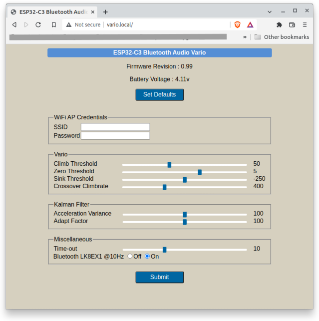

# ESP32C3_BLUETOOTH_AUDIO_VARIO
 Accurate, zero-lag audio feedback variometer using Kalman filter fusion of accelerometer and pressure sensor data. 
 This project uses the KF4D kalman filter algorithm from the [ESP32_IMU_GPS_BARO_VARIO](https://github.com/har-in-air/ESP32_IMU_BARO_GPS_VARIO) project.
* WiFi webpage configuration with the vario acting as an access point and web server.
* WiFi Over-the-air (OTA) firmware update 
* Bluetooth LE transmission of $LK8EX1 sentences. You can then use flight instrument apps like [XCTrack](https://xctrack.org/) on a smartphone/tablet with 
accurate barometric altitude and climb/sink rate data.
* Push-pull L9110S driver with conventional loudspeakers for higher audio volume. This is optional - you can drive a piezo buzzer directly from the ESP32-C3 pin for minimal component count at the cost of reduced audio volume.

# Software Build Environment 
* Ubuntu 20.04 LTS AMDx64
* Visual Studio Code with PlatformIO plugin using Arduino framework targeting `esp32dev` board. The file `platformio.ini` specifies the framework packages and toolchain required for the ESP32-C3, and the libraries used by the project. 
* A minor type-cast compile error for the AsyncTCP library has to be fixed by editing the local version of the library source code in the project `.pio` subdirectory. You will see the build error if you select `Clean All` before build. Fix : Replace 0U by (uint32_t)0.
* Custom `partition.csv` file with two 1.9MB code partitions supporting OTA firmware updates
* ~160kByte LittleFS partition for hosting HTML web server pages

# Hardware

* ESP32-C3 12F 4MByte flash (AI Thinker)
* CJMCU-117 10-DOF IMU module with MPU9250 and MS5611 sensors
* L9110S IC used as a push-pull driver for louder volume 

# Hardware Notes

## NCS pin pullup
The CJMCU-117 `NCS` pin should be connected with a wire directly to the 
CJMCU-117  LDO regulator 3.3V output.

## I2C pullup resistors
The 10K I2C pullup resistors on the CJMCU-117 board should be replaced with 3.3K for a reliable interface at 400kHz.

## LDO regulator specification
The TLV75533 3.3V LDO regulator has a high current rating of 500mA and is suitable for the ESP32-C3 power supply, which has high current spikes on wifi transmit bursts. 

## Optional Components
The optional circuit components are marked with dashes on the schematic. Do not populate them if you don't need the L9110s loud(er) speaker driver option. 

You can first test the board with a direct connection from AUD pin to a piezo speaker and the other piezo
pin connected to ground. 
If you mount the vario on your shoulder and/or have an open-face helmet, the volume level is probably enough without populating the L9110S push-pull driver circuit.

If you want louder audio, install the L9110s circuit option. If this is still not loud enough, replace the piezo transducer with a magnetic coil loudspeaker of at least 8 ohms impedance. Make sure you use at least a 47 ohm resistor for R5 to keep current pulses manageable. 
Ensure there is no air path from the front of the loudspeaker 
to back or else the front wave will cancel the back wave. 
Use silicone  to seal the edge of the speaker to the pcb, that will do the job. 
Put some soft foam tape on the back of the speaker so that vibrations don't get transmitted 
to the MPU9250 or MS5611.

Replacement speaker-phone (NOT earpiece) drivers for mobile phones are a good choice.  You can put two in series for 16ohms impedance, but make sure they are in phase.

A few components may not be readily available on Aliexpress/Ebay. You can find them on Mouser/Digikey :
* Ferrite bead 600ohms@100MHz : BLM18AG601SN1D
* TI TPS22918 high-side switch 
* Broadband piezo speaker : PUI Audio AT2310TLW100R, Kingstate KPEG006 

Battery current drain is `~30mA` operating as audio vario with bluetooth LE disabled. 

Battery current drain is `~85mA` operating as audio vario with bluetooth LE LK8EX1 message transmission @ 10Hz.

# Software Build Notes

## Compile Feature Options
* Feature support compile options are in `config.h`
* For a minimal audio vario with the ESP32-C3 directly driving a piezo transducer, set `CFG_L9110S` to false.
If you want support for louder volume using the L9110S push-pull driver IC, set `CFG_L9110S` to true.   

## Build Steps
* The first time you flash the ESP32-C3 with this project code, select `PROJECT TASKS -> esp32c3 -> Platform -> Erase Flash`. 
* Next, select `Platform -> Build Filesystem Image`. This will build a LittleFS flash partition with the contents of the `/data` directory. The `/data` directory contains the static HTML and CSS files for the WiFi server webpage.
* Next, select `Platform -> Upload Filesystem Image`. This will flash the LittleFS data partition to the ESP32-C3.
* Next, select `General -> Clean All`, then `Build`. You may see (if the issue has not been fixed) this build error : 
```
Compiling .pio/build/esp32c3/libfe7/ESP Async WebServer/WebServer.cpp.o
.pio/libdeps/esp32c3/ESP Async WebServer/src/AsyncWebSocket.cpp: In member function "IPAddress AsyncWebSocketClient::remoteIP()":
.pio/libdeps/esp32c3/ESP Async WebServer/src/AsyncWebSocket.cpp:832:28: error: call of overloaded "IPAddress(unsigned int)" is ambiguous
         return IPAddress(0U);
```
Fix the error by replacing 0U with (uint32_t)0. 
* From now on, only select `General -> Clean` to avoid pulling in the original library source code again.
* Select `Build` and then `Upload and Monitor` to build and flash the application firmware binary.
* Ensure the serial debug monitor is visible, then reset or power-cycle the ESP32-C3 module. Since there is no calibration data, you will see a calibration error message. Follow the prompts to calibrate both accelerometer and gyroscope.
[This is a startup serial monitor log after a full flash erase.](docs/first_boot_log.txt). 
* The gyroscope is re-calibrated each time on power-up. You should leave the vario undisturbed when you hear the count-down beeps for gyroscope calibration. If the vario is disturbed during the gyro calibration process, it will use the last saved gyro calibration parameters.
* [This is a startup serial monitor log of the vario with calibrated accelerometer.](docs/normal_boot_log.txt). 


# WiFi Configuration

To put the vario into WiFi AP server mode, switch on the vario and immediately press and hold the `PCC` button. When you hear a confirmation tone, release PCC. 

Connect to the WiFi Access Point `Vario-AP`, no password needed. 

Open the url `http://192.168.4.1` in a browser.
You can use `http://vario.local` with any OS that has mDNS support. MacOS has built-in support. For Ubuntu, install Avahi. For Windows install Bonjour.

You can now configure an external WiFi Access Point SSID and password. 
Then you do not have to switch between your home WiFi network and the vario Access Point to be able to configure the vario. 
After configuration, restart the vario and trigger wifi configuration mode again.

Now if the external Access Point is available, the vario will connect to it as a client, and then start the configuration web server. 
If your OS has mDNS support, use the url `http://vario.local` for configuration. 
Else you will have to watch the serial monitor to find the dynamically assigned IP address.

If the configured external AP is not available (or configured with wrong credentials) the vario will fall back to the stand-alone Access Point and web server. 
So you can still configure the vario in the field.



# WiFi OTA Firmware Update
You will find the compiled binary file `firmware.bin` in the project directory `.pio/build/esp32c3/`. 

Put the vario into Wifi configuration mode and then open the url `http://192.168.4.1/update` (`http://vario.local/update`) in a browser.

Upload the `firmware.bin` file. Switch the vario off and on again. 
Select WiFi configuration mode again. 
If the firmware revision string has been updated in the new firmware binary, you can confirm the updated revision in the home page url `http://192.168.4.1` (`http://vario.local`).


