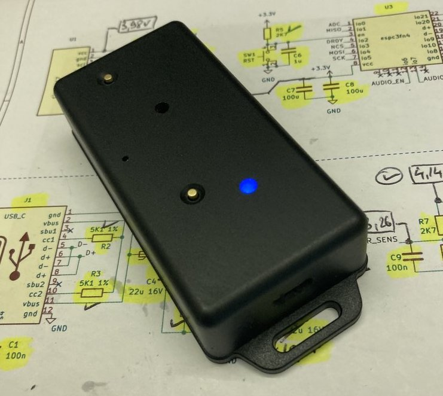
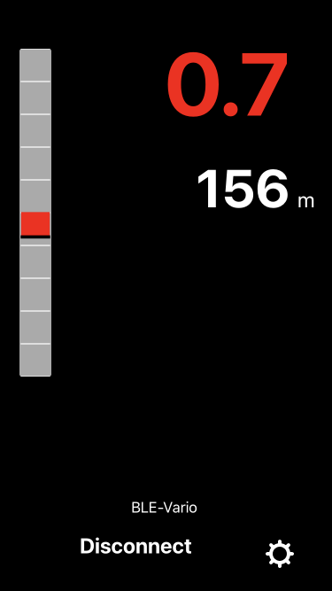

# ESP32C3_BLUETOOTH_AUDIO_VARIO




 * Accurate, zero-lag audio variometer using Kalman filter fusion of accelerometer and pressure sensor data. 
 This project uses the [KF4D kalman filter algorithm](https://github.com/har-in-air/ESP32_IMU_BARO_GPS_VARIO/blob/master/offline/kf/compare_kf2_kf3_kf4.ipynb).

* WiFi Vario configuration via web page.
* Bluetooth LE transmission of [$LK8EX1 sentences](https://github.com/LK8000/LK8000/blob/master/Docs/LK8EX1.txt), to provide apps like [XCTrack](https://xctrack.org/) with 
accurate barometric pressure altitude and climb-rate data.
* Soft-switched power on/off.
* 'No activity' time-out power down  to conserve battery life.
* WiFi Over-the-air (OTA) firmware updates.
* [2-layer PCB layout available, sized for standard Hammond 1551K enclosure](https://github.com/har-in-air/VhARIO-ESPC3).
  

# Software Build Environment 
* Ubuntu 24.04 LTS AMDx64
* [Visual Studio Code with PlatformIO plugin using Arduino framework](https://randomnerdtutorials.com/vs-code-platformio-ide-esp32-esp8266-arduino/) 
* The file `platformio.ini` specifies the framework packages, toolchain and libraries used by the project. 
* LittleFS partition for hosting HTML web page content.
* Since release v1.20, the software only supports PCB layout revision B.

# Hardware

* AI-Thinker ESP-C3-12F C3FN4 module (4MByte flash, Wi-Fi and Bluetooth LE)
* CJMCU-117 module with MPU9250 9-DOF IMU and MS5611 barometric pressure sensor
* TLV75533 LDO regulator, max current 500mA
* KPEG006 broadband-audio piezo transducer
* 74HC240 used as a push-pull piezo driver for louder volume 
* MCP73871 Li-poly battery charger, max 500mA charging current
* 1800mAHr Lipoly battery
* The USB C interface supports Li-Poly battery charging and program flash/debug.

## Current Drain

With Bluetooth LE disabled, current drain is ~30mA.

With Bluetooth LE enabled and transmitting LK8EX1 messages at 10Hz, current drain is ~85mA.

# Software Build Notes

## Build Steps

* The first time you flash the ESP32-C3 with this project code, select `PROJECT TASKS -> esp32c3 -> Platform -> Erase Flash`. This will wipe the entire flash including any previous partition tables. 
* Next, select `Platform -> Build Filesystem Image`. This will build a LittleFS flash partition with the contents of the `/data` directory. The `/data` directory contains the static HTML and CSS files for the WiFi server webpage.
* Ensure the vario is switched off. 
* Connect the USB cable from your PC to the vario. 
* Press and hold the `PCCA (SW4)` button. 
* Close the jumper or slide-switch (`JP1/SW2)` depending on which part you have installed. 
* Release the `PCCA (SW4)` button. 
* You will see the USB serial/jtag port show up as a new serial port. On Ubuntu it will be `/dev/ttyACMx` instead of `/dev/ttyUSBx`. Set this new port as the upload and monitor port in platformio.ini.
* Next, select `Platform -> Upload Filesystem Image`. This will flash the LittleFS data partition to the ESP32-C3.
* Next, select `General -> Clean All`, then `Build`. This is only required once, to download the source code for the dependent libraries and build them. 
* If the libraries have already been downloaded and compiled, select `General -> Clean` to re-build only the project application code.
* Select `Build` to compile the application firmware binary. 
* Open the jumper/slide switch (`JP1/SW2`) to remove power. 
* Repeat the earlier steps with `PCCA (SW4)` and the jumper/slide switch  (`JP1/SW2`) to set up for flashing the application firmware.
* Select `Upload` to flash the application firmware binary.
* To see  serial debug prints and prompts on boot, open the  jumper/slide switch (`JP1/SW2`) to remove power. 
* Select `Monitor` in Visual Studio Code and then switch on the vario using the `PWR (SW3)` button. Note that the
serial port may change from the one used for upload e.g. from `ttyACM0` to `ttyACM1`.  

* After a full chip erase and firmware upload, there is no calibration data. So you will see a calibration error message. Follow the prompts to calibrate both accelerometer and gyroscope. Once complete, the calibration parameters will be saved to flash.
* [Example startup serial monitor output example after a full flash erase and build.](docs/first_boot_log.txt) 
* Example serial terminal output for normal vario boot (post-caliibration) : 

```
ESP-ROM:esp32c3-api1-20210207
Build:Feb  7 2021
ESP-ROM:esp32c3-api1-20210207
Build:Feb  7 2021
rst:0x15 (USB_UART_CHIP_RESET),boot:0xc (SPI_FAST_FLASH_BOOT)
Saved PC:0x42083766
SPIWP:0xee
mode:DIO, clock div:2
load:0x3fcd5810,len:0x438
load:0x403cc710,len:0x90c
load:0x403ce710,len:0x2624
entry 0x403cc710
E (236) esp_core_dump_flash: No core dump partition found!
E (236) esp_core_dump_flash: No core dump partition found!


ESP32-C3 BLUETOOTH VARIO compiled on Apr  8 2025 at 15:48:49
Firmware Revision 1.01

Load non-volatile configuration and calibration data from flash
WiFi AP credentials
SSID = 
VARIO
climbThresholdCps = 50
zeroThresholdCps = 5
sinkThresholdCps = -250
crossoverCps = 400
KALMAN FILTER
accelVariance = 100
adapt = 100
MISCELLANEOUS
pwrOffTimeoutMinutes = 10
bleEnable = true
Calibration Values
axBias = -390
ayBias = -182
azBias = 234
gxBias = 17
gyBias = -7
gzBias = 22
To start web configuration mode, press and hold the PCC button
until you hear a low-frequency tone. Then release the button
8
7
6
5
4
3
CPU Freq = 80 MHz
XTAL Freq = 40 MHz
APB Freq = 80000000 Hz
Vario mode

Audio indication of battery voltage

Battery voltage = 4.13V
E (4666) ledc: ledc_get_duty(745): LEDC is not initialized

Check communication with MS5611
crcPROM = 0x9, crc calculated = 0x9
MS5611 OK

Check communication with MPU9250
MPU9250 ID = 71, expected 0x71
MPU9250 OK
Counting down to gyro calibration
Press the PCCA button to enforce accelerometer calibration first
10
9
8
7
6
5
4
3
2
1

Calibrating gyro
Num Tries = 1
gxBias = 18
gyBias = -7
gzBias = 22
Gyro calibration OK

MS5611 config
MS5611 Calibration Coeffs : 48939 50595 29263 26380 30963 26826
Tavg : 35C
Pavg : 90986Pa
Zavg : 89864cm

KalmanFilter config
climbToneCps = 50
zeroesToneCps = 5
sinkToneCps = -250
crossoverCps = 400

Bluetooth LE LK8EX1 messages @ 10Hz

```
* The gyroscope is re-calibrated each time on power-up. You should leave the vario un-disturbed (in any orientation) when you hear the count-down beeps for gyroscope calibration. If the vario is disturbed during the gyro calibration process (e.g. you switched the vario on during flight), it will use the last saved gyro calibration parameters.


# WiFi Configuration

To put the vario into WiFi AP server mode, switch on the vario and immediately press and hold the `PCCA (SW4)` button. When you hear a confirmation tone, release the button. 

Connect to the WiFi Access Point `Vario-AP`, no password needed. 

Open the url `http://192.168.4.1` in a browser.
You can use `http://vario.local` with any OS that has mDNS support. MacOS has built-in support. For Ubuntu, install Avahi. For Windows, install Bonjour.


## Configuration Options

### WiFi Credentials
Enter your home WiFi Access Point SSID and password so that the vario can connect to the access point as a station. Then you can just enter the webpage url `http://vario.local` to access the vario configuration web page.

If the external Access Point is not configured or the configured access point is not available, e.g. on the launch site, the vario will configure itself as a standalone Wifi Access Point with SSID `Vario-AP`, no password. You can use your phone or tablet to connect first to this access point. Then access the webpage url `http://vario.local` as before.

### Audio Tone configuration


The climb tone threshold should be configured for what you consider the minimum climbrate that you can turn in without losing height. The range is +20cm/s to +100cm/s.

Since a paraglider has a 'hands-up' sink rate of approximately -1m/s in still air, anything more than this indicates rising air. 
The zero tone is used to indicate air that is rising, but not strong enough for aggressive turns. The range is -20cm/s to +20cm/s. 

The sink tone is used to indicate sinking air, not a sinking glider. The range is -400cm/s to -100cm/s.

Note that these thresholds are purely personal choices, depending on how 'talkative' you want the vario to be.

The crossover climbrate is used to adjust the frequency discrimination. The vario allocates 3 octaves of audio bandwidth to climbrates below this threshold, and 1 octave
above the threshold. So if the expected average thermal strength is +5m/s, set the threshold to 500.

### Kalman Filter configuration
Set the `variance` parameter lower for conditions with soft, wide and smooth-edged thermals. Set the parameter higher for conditions with strong, narrow and hard-edged thermals.

The `adapt` parameter will probably be removed after flight trials. Higher values add more uncertainty into the Kalman filter so it can respond to high acceleration transitions quickly, while maintaining a high degree of damping in zero acceleration conditions.

### Inactivity Time-out
The vario will power off automatically to save battery life if it does not detect climb/sink rates beyond a minimum threshold within a specified interval (specified in minutes). If you often stand on the launch site for several minutes, hooked-up to the glider and waiting for launch conditions to improve, use a larger time-out.

### Bluetooth LK8EX1
If you enable this option, the vario will transmit $LK8EX1 sentences using the Bluetooth LE protocol at 10Hz. The Bluetooth device name is `BLE-Vario`.

`XCDisplay` app on Apple iPhone connected to the vario, displaying pressure altitude and climbrate.


# Usage

## Power On 
To power on, press the `PWR (SW3)` button and hold (~1 second) until you see the power/bluetooth LED turn on. Release.

The vario will first indicate the battery charge status with a series of long beeps. 5 beeps for fully charged, 1 beep for discharged.

After a pause, the vario will indicate the countdown to gyro calibration with a series of 10 shorter beeps. You should ensure the vario is left undisturbed, in any orientation (do not hold it in your hand). At the end of the countdown and a brief pause, you may hear an initial squawk as the filter initializes, but it should settle down in a few seconds. Now the vario is operational and providing audio feedback.

If you want to force accelerometer re-calibration, press the `PCCA (SW4)` button during the gyro calibration countdown. Now the vario will start a 50 short beep countdown at a fast rate. At this point you should place the vario flat on a horizontal surface (confirm with a bubble level if possible) without any disturbance, vibrations etc. Do not hold or press down on the vario case. At the end of the 50 beeps, the accelerometer will be calibrated, and then the countdown to gyro calibration will start.

### Power/Bluetooth LED
If Bluetooth transmission is disabled, the power/bluetooth LED will stay on.

If Bluetooth transmission is enabled, the power/bluetooth LED will start blinking once every 2 seconds after transmission starts.

### Audio Mute 
When the vario has finished initialization and is providing vario audio feedback, a brief press of the `PCCA (SW4)` button  will toggle the audio on / off.

This is convenient if you have set the zero-tone threshold to a negative value or close to zero and don't want the distraction of a beeping vario while you are hooked in to the glider and waiting to launch.

## Power Off
To power off, press the `PWR (SW3)` button and hold (~2 seconds) until you hear a confirmation audio tone. If the power/bluetooth LED was on, it will turn off as well. Release.

# Notes on Calibration and Use
The accelerometer offset calibration with the vario in a horizontal position needs to be done AFTER the board is installed in the case and BEFORE first use.

Gyro offset calibration is done on each power up. For that the only requirement is that the unit should not be disturbed, it can be in any orientation.  If it is disturbed, it will use the previous saved gyro offsets. This will not be an issue  if you successfully calibrated the gyro in the past few days and are flying in similar temperature conditions.

After offset calibration and in normal use the AHRS software computes the vario orientation in Earth coordinates and then the 
net acceleration along the Earth coordinates +Z axis, every 2mS. This is NOT the IMU chip z axis acceleration. 

So the vario does not have to be horizontal during use, you can mount it to your waist strap or riser.

You will need to redo the accelerometer offset calibration if you have reinstalled the board in the case, or tightened/loosened the mounting screws. The stress from the mounting screws will translate to stress on the MEMS structures in the IMU chip soldered to the module board, which will change the axis offsets. 

My friend who mounted the module board with a standard 0.1in header to the main PCB had very large accelerometer offsets. I was concerned that he had a defective MPU9250 chip. He reinstalled the IMU module board with double-sided foam tape and thin flexible wires, and then the offsets on all axes were very low.

The accelerometer calibration will remove the offsets, but it's good to remove external contributing factors, especially if the offset is so large that it affects the dynamic range. 

# Credits

Prototype design, component sourcing, PCB assembly and testing in collaboration with Benoit Arnal.
 


